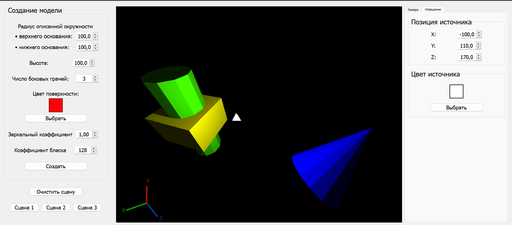
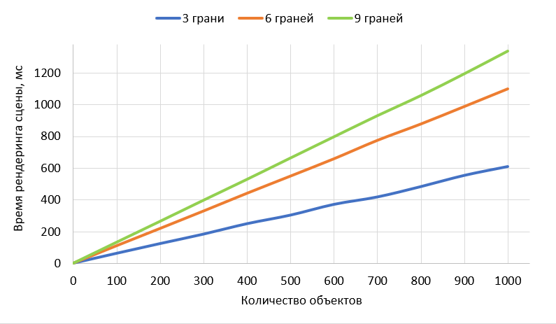
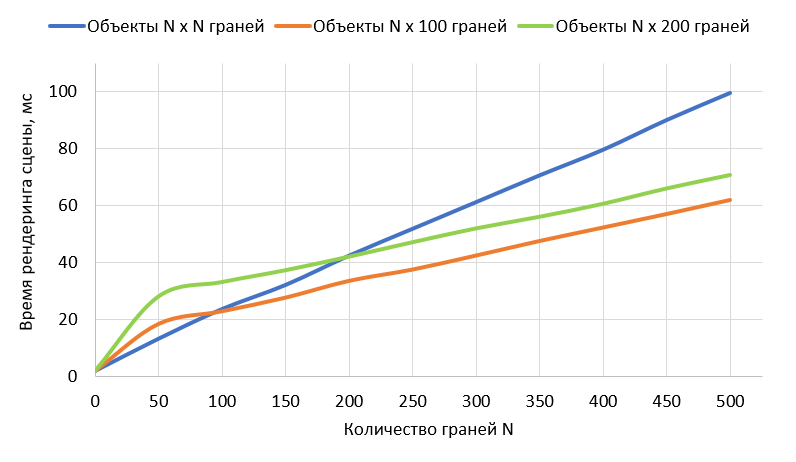

# Курсовая работа (КуР) по Компьютерной Графике

> BMSTU IU7 5 семетр 2022

### Название: _Графический редактор многогранников._

## Тезническое задание (ТЗ)

Разработать программное обеспечение с пользовательским интерфейсом для построения композиции из многогранников. Интерфейс должен позволить задавать параметры для построения многогранника,  должна быть возможность изменение параметров (цвета, количество граней, высота, радиус нижнего и верхнего основания), положение в пространство (перемещение и поворот) и спектральных характеристик. Проектируемый программный продукт должен позволять изменение местоположение камеры(только 1) и источника света (только 1-го).

- [Файл с ТЗ](https://github.com/Mansurow/bmstu-cg-course/blob/master/docs/РПЗ/ТЗ.doc)
- [Файл с РПЗ](https://github.com/Mansurow/bmstu-cg-course/blob/master/docs/РПЗ/ИУ7-56Б_Мансуров_КуР_РПЗ.pdf)
- [Презентация](https://github.com/Mansurow/bmstu-cg-course/blob/master/docs/presentation/main.pdf)

## Пример работы

## Графики исследования

